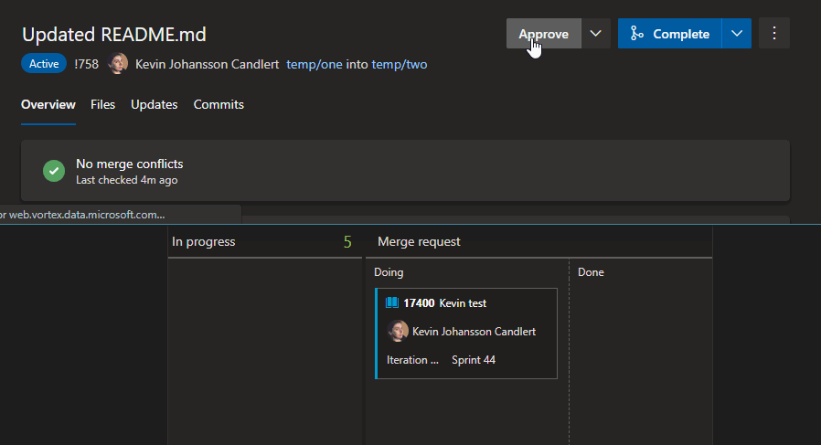

## Move Work Items When Pull Request Completes
This is how I found an alternative solution for the annoying 'Complete associated work items after merging'. When the checkbox for 'Complete associated work items after merging' is ticked the work item gets its status changed to closed.

However, we want to move our work items to a column in our board to mark the work item ready for QA. It's not done and shouldn't be closed after the pull request is done.

In a perfect world where each pull request branch could be deployed and tested individually then yes, that would be awesome. However, in the projects I work on we can't do that.

### Webhooks is the key
Azure DevOps has webhooks for different kinds of events built it. I'm using the *Pull request updated*. Using this event we'll get notified whenever the pull requests updates and we can check when $.resource.mergeStatus equals "succeeded" and $.resource.status equals "completed" in the JSON request body.

### Setup
You need to provide an [personal access token](https://docs.microsoft.com/en-us/azure/devops/organizations/accounts/use-personal-access-tokens-to-authenticate?view=azure-devops&tabs=preview-page) with **Work Items (Read & Write)** access and the organization name for your DevOps organization. You can find your organization name in the URL.

e.g.
`https://{YOUR ORGANIZATION NAME HERE}.visualstudio.com/` or `https://dev.azure.com/{YOUR ORGANIZATION NAME HERE}/`

Next, you need to figure out what column you want to be your "Pull Request" column.
The important thing is that your column is split into "Doing" and "Done".
This is how our later part of our board looks like:

When a work item is done and a pull request is created it is moved to "Merge Request - Doing".
This board column has a "hidden" ID that we need to use. I find it simple to use the "Get Work Item" API and a dummy work item.

1. Create or temporarily move a work item into your "Pull Request - Doing" column.

1. Go to https://dev.azure.com/{organization}/{project}/_apis/wit/workitems/{work_item_id}?api-version=5.1 (Be sure to change `{organization}`, `{project}` and `{work_item_id}` to your variables in the URL above. **Don't worry you can run multiple projects from the same organization on one Azure Function instance**, you'll have to get this unique column ID for each project and pass it as a parameter on the webhook URL)

1. Now that you got the JSON response look for two fields that start with "WEF_". This is the column ID you're looking for. `e.g. WEF_CB9F844F2BD65E45BDFE13BD15567897`

1. Deploy the Azure Function in this project to Azure in order to receive an HTTP trigger URL. This is the URL which will be our base for the webhook.
`e.g. myAwesomeAzureDevOpsFunctions.azurewebsites.net/api/MoveWorkItemsWhenPullRequestComplete?`

1. Add two AppSettings/Environment variables of your Azure Function. `Organization` and `PersonalAccessToken`. Set the values of these variables using your organizations name and your personal access token with Work Items (Read & Write) access

1. We'll append to this base URL with the column name and ID of our "Pull Request" column. The value of the field `System.BoardColumn` or `WEF..._Kanban.Column` from the API response from step 2 and the column ID from step 3 like this: myAwesomeAzureDevOpsFunctions.azurewebsites.net/api/MoveWorkItemsWhenPullRequestComplete?kanbanColumnName={columnName}&kanbanColumnId={columnId}
(Be sure to change `{columnName}` and `{columnId}` to your variables in the URL above)

1. It's now time to set up the webhook in Azure DevOps. Go to [project settings](https://{organization}.visualstudio.com/{project}/_settings/service Hooks) and click on *Service hooks*.

1. Click on the green cross  to add a new service hook and choose WebHooks and click *Next*

1. On the next dialog change the trigger to be "Pull request updated"
  
You can also change the "Change" field to "Status Changed". Press *Next*

1. Enter the URL from step 6 and press *Finish*

To try this out, create a new pull request with your newly created or temporarily moved work item from step 1. Make sure the work items are linked to the pull request and when it's completed the pull request should move automagically!

If you have multiple organizations and only want to run one Azure Function instance you could woth a little bit of code change and move the Organization and PersonalAccessToken environment variables to query string variables. That will centralize all your configuration in the Service hooks pages for each individual project.